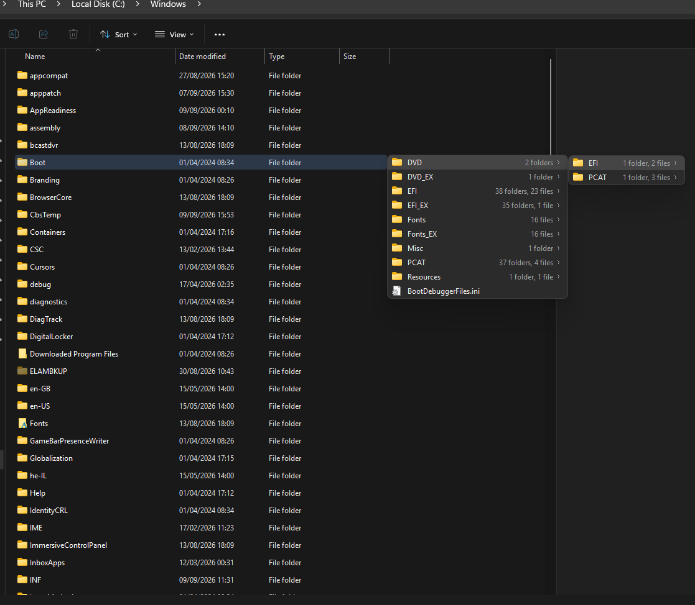
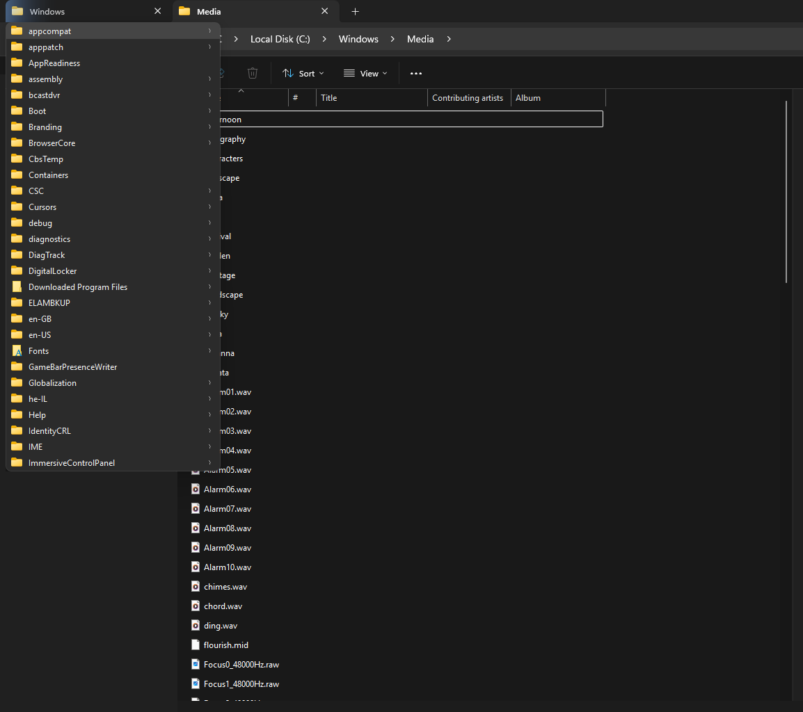
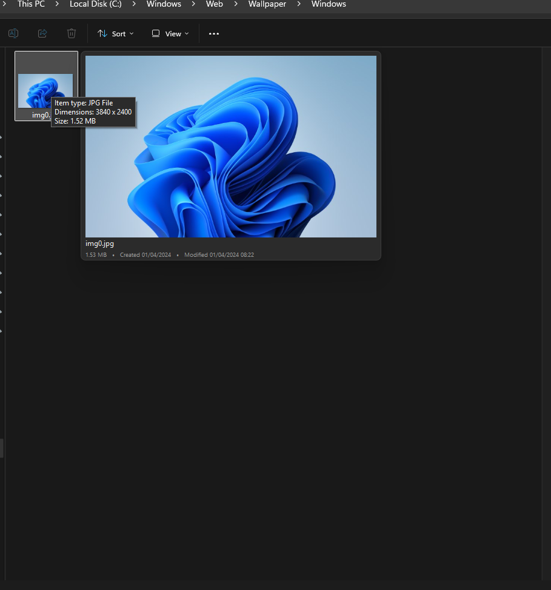
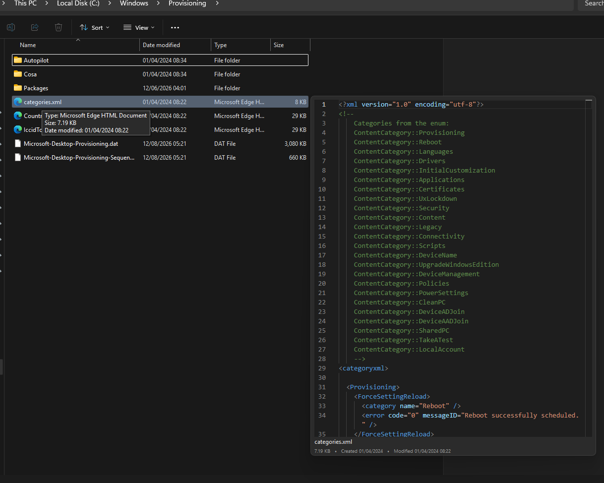
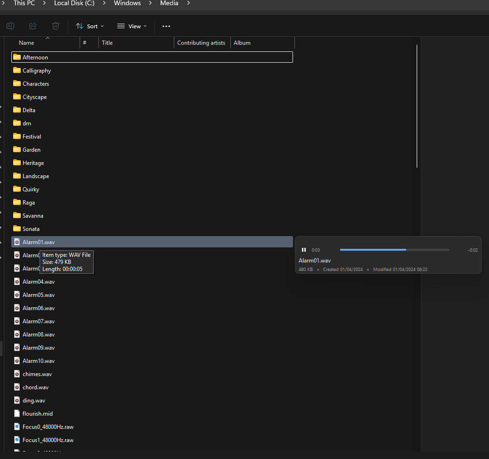

# Explorer Extras

QTTabBar-style conveniences for File Explorer on Windows 11, built the native
way: an ordinary user-level process, no code injected into `explorer.exe`.

**[Download the latest release](https://github.com/aryehsilver/ExplorerExtras/releases/latest)** —
a single executable, no installer. Run it and it puts an icon in the
notification area and starts with Windows from then on.

| Feature | Status |
| --- | --- |
| Double-click empty space to go up a folder | Implemented |
| Hover a folder for a drill-down subfolder tip | Implemented |

## Subfolder tips

Rest the pointer on a folder in the file list and, after 400ms, a popup lists
what is inside it — folders first, then files, in Explorer's natural sort order,
with real shell icons. Hovering a folder row in the popup cascades another level;
clicking any row opens it. Moving away dismisses the chain after a short grace
period.

The popups are `WS_EX_NOACTIVATE` and answer `WM_MOUSEACTIVATE` with
`MA_NOACTIVATE`, so Explorer never loses focus. They are per-monitor DPI aware,
follow the light/dark setting, and use rounded corners on Windows 11.

Detection is driven by a 60ms tick on the worker thread rather than by mouse
messages. The hook must stay off the input path, and a tick is also the only
thing that notices the pointer *leaving* — no single event gives you that.

**Files** get a preview, by one of two routes.

Where a preview handler is registered for the type, that handler is hosted —
the same `IPreviewHandler` Explorer's own preview pane uses. That is what makes
a PDF scrollable and code syntax-highlighted: none of it is reimplemented here,
it is whatever is already installed. Move the pointer into the preview to
scroll it; it stays open while the pointer is inside.

**Audio and video** have no registered preview handler, so they are played
directly through Media Foundation's `IMFMediaEngine` in windowed mode — video
renders into the preview window, audio gets a slim strip rather than a large
black rectangle. Playback starts at half volume, since a hover should not
startle, and stops the moment the preview closes. It has its own tray toggle.

Media previews carry a transport strip: elapsed time, a progress bar, and time
remaining counting down. Click the bar to seek, click the video to pause. Only
the strip repaints on each tick, so the video is never disturbed by it.

Video renders into a **child window** sized to the content area rather than into
the preview window itself. In HWND playback mode the Media Engine paints over
the whole window it is handed, which swallowed the transport strip and footer a
moment after playback began. Audio needs no such child — there is no video
stream to paint — so it draws the track's album art directly, falling back to a
slim strip when the file carries none.

Every preview footer shows the file name, its size, and when it was created and
last modified, in your locale's own date formats.

### Opening a folder from a tip

Activating a folder opens it in a **new window**, not a new tab, and that is a
platform limit rather than a choice. Windows registers an `opennewtab` verb
under `HKCR\Folder\shell`, but it is marked `OnlyInBrowserWindow` and Explorer
contributes it from its own frame menu. An out-of-process context menu for the
same item never carries it — the verbs actually offered are `open pintohome …
copyaspath cut copy link delete properties`, with no browser verbs at all.
Handing the menu a site that vends `SID_SShellBrowser` does not change this.

The only thing that would work is the undocumented `ITabWindowManager`, and a
feature that exists only as long as an undocumented interface does is not worth
shipping. The code attempts the verb anyway and falls back, so it will start
working if the shell ever exposes it.

Otherwise it falls back to a shell thumbnail — images and video poster frames,
which have no handler registered. Extraction runs on its own STA thread
(`ThumbnailLoader`) because `GetImage` can take seconds for an uncached video
and would otherwise freeze the tip. Only the newest request survives; hovering
down a list discards the ones overtaken on the way.

Both are independently switchable from the tray: subfolder tips and file
previews are separate toggles.

Those counts are **immediate children only, never recursive**. A recursive total
means walking a whole tree, which is why Explorer itself shows no folder size in
a details view. Counting also stops at 2000 entries per folder and reports
"2000+ items", so one enormous folder cannot hold up a tip: listing `C:\Windows`
costs 192ms with counting against 13ms for an ordinary folder, and without the
cap it would be far worse. Switch the counts off and the cost disappears
entirely — the code then only asks whether a folder is empty, which stops at its
first entry.

**Window tabs** get the same treatment: hovering the **leading third** of a tab
drops its folder's contents down beneath it. Only that third, so moving across a
tab on the way to clicking it does nothing; and never the active tab, which is
already on screen. The zone tints while the pointer is in it, so it is obvious
what opened the drop-down — a translucent `WS_EX_TRANSPARENT` layered window
over the tab, since we cannot draw inside Explorer's XAML.

Tabs are matched to their folder on the tab's label, since the XAML tab strip
and the `ShellTabWindowClass` children have no handle in common.

The tint is drawn with `UpdateLayeredWindow` from a premultiplied 32bpp DIB,
because it needs per-pixel alpha: it fades out towards the right, and its
top-left corner is cut to the tab's own radius with fractional coverage so the
curve is not jagged. `SetLayeredWindowAttributes` can only apply one alpha to a
whole window, which is why it is not used here.

**Leaving** is deliberately forgiving. The pointer travelling from a row to what
that row opened rarely goes in a straight line, and an exact hit test makes the
popup vanish mid-journey — the common way to lose a preview is to clip the
corner of the gap on the way to it. So the pointer is allowed to be anywhere in
any open window, the row it came from, the corridor between each of those pairs,
or within 16dip of any of them, and it has 800ms outside all of that before
anything closes. A tip that has been filtered down counts by the largest
footprint it has had rather than its current size, so shrinking the window does
not move the pointer out from under itself.

**Right-click** any row, or the preview, for Explorer's own context menu —
the real `IContextMenu`, so every installed shell extension is in it. **Drag**
any row or preview and it becomes a real OLE drag source via `SHDoDragDrop`,
droppable anywhere that accepts a file. Both need `OleInitialize` on the worker
rather than plain `CoInitializeEx`, and both run modal loops that keep pumping
our tick timer — hence the `modal_` guard, without which the tip would dismiss
itself out from under the menu.

**Keyboard**: up/down move, right expands a folder, left returns to the parent
level (and closes at the first), Enter opens, Escape dismisses. The top row is
selected when a tip appears.

**Typing filters the list.** Any letter, digit or punctuation narrows the tip to
the names containing what has been typed, matched case-insensitively and
anywhere in the name rather than only at the start; backspace rubs out a
character and Escape clears the filter before it dismisses anything. A footer
appears with the text and how many of the folder's items survived it, since the
tip has no focus and nothing else would explain the list changing.

A filter searches the whole folder, not the 300 items a tip lists: on the first
keystroke a truncated listing is re-read in full, so a name that is there is
never reported missing. That re-read defers row icons — `SHGetFileInfoW` opens
each file and parses an icon resource out of every executable, which is three
seconds for `System32` and 66 milliseconds without — and the rows that end up
on screen resolve theirs as they are drawn.

Since the tip never takes focus it receives no key input, so `KeyboardHook`
borrows these keys — but only while a tip is on screen, and never when
Ctrl/Alt/Win is held, so Explorer's own shortcuts are untouched. (Shift is
allowed through for typing and blocked for the arrows, which Explorer uses to
extend a selection.) It also swallows the matching key-up, so no application
sees a dangling press.

**Activating a folder** uses the `opennewtab` verb registered under
`HKCR\Folder\shell`, so it opens as a tab in the existing window rather than a
new window, falling back to the default verb where that verb is absent.

## What it looks like

Hover a folder and its contents appear beside it. Hover a folder in that list
and it cascades again, as deep as you like. Folders with nothing in them get no
chevron, so the arrow never promises something that isn't there. Each folder is
annotated with what it holds — "8 folders, 1 file" — so a busy folder is
obvious before you open it.



Window tabs work the same way. Hover the leading third of an inactive tab and
its folder drops down beneath it; that zone tints so it is obvious what opened
it, and the rest of the tab stays an ordinary click target.



Hover a file instead and you get a preview of it. Images use a shell thumbnail:



Anything with a registered preview handler is hosted directly — the same
component Explorer's own preview pane uses — so code and markup arrive
syntax-highlighted and PDFs scroll:



Audio and video play, with elapsed time, a progress bar you can click to seek,
and the time remaining counting down:



Every preview footer carries the file's name, size, and when it was created and
last modified.

## Build prerequisites

Visual Studio 2026 is installed on this machine but the **C++ toolset is not**:
`VC\Tools\MSVC\14.51.36231` has `bin` and `lib\onecore` but no `include`, and
the C++ standard library headers are absent everywhere in the VS tree. Only
`Microsoft.VisualStudio.Component.Windows11SDK.22621` is registered.

Install the missing component (elevation required, ~2 GB):

```
"C:\Program Files (x86)\Microsoft Visual Studio\Installer\vs_installer.exe" modify --installPath "C:\Program Files\Microsoft Visual Studio\18\Community" --add Microsoft.VisualStudio.Component.VC.Tools.x86.x64 --norestart
```

Without it the build stops at `MSB8003: The PlatformToolset property is not
defined` — the Desktop `Platform.Default.props` that supplies the default
toolset ships with that component. The project deliberately does not pin a
toolset, so it picks up v145 (VS 2026) or v143 (VS 2022) automatically.

Then:

```powershell
.\build.ps1 -Configuration Release -Run
```

The build script stops any running instance first, since it locks the output
binary.

## How it works, and why it is built this way

QTTabBar hooked Explorer from the inside: a band object loaded into
`explorer.exe`, subclassing its windows. That is why it broke on Windows
updates. None of it is necessary.

Everything here runs out-of-process:

| Need | Mechanism | Measured on Windows 11 26200 |
| --- | --- | --- |
| Is the pointer over an Explorer window? | `WindowFromPoint` + `GetAncestor` + class check | 0.16–0.39 ms |
| Empty space, or a row? | UI Automation `ElementFromPoint`, walk to `ListItem` / `UIItemsView` | ~1–2 ms |
| Which tab is active? | `IShellWindows` → `IServiceProvider(SID_STopLevelBrowser)` → `IShellBrowser` → `QueryActiveShellView` | — |
| Go up a folder | `IShellBrowser::BrowseObject(NULL, SBSP_SAMEBROWSER \| SBSP_PARENT)` | `S_OK` in 0.7 ms |

If this process crashes, Explorer is untouched.

### Three things Windows 11 gets you wrong

These were each measured on this machine, not assumed. They are the reasons the
code looks the way it does.

**1. Every tab is its own `IShellWindows` entry, and they all share one HWND.**
A five-tab window returns five entries, all reporting the same top-level
window, so matching on the frame HWND alone is ambiguous.

The disambiguator is `IShellBrowser::GetWindow()`, which returns that tab's
`ShellTabWindowClass` — unique per entry, and reachable from a screen point by
walking up from `WindowFromPoint`. `FindTabWindow` does exactly that.

**Do not use view visibility for this.** It is the obvious approach and it is
wrong: on a restored three-tab window, all three `SHELLDLL_DefView` windows
report `IsWindowVisible == true`, so "the visible one" picks whichever entry
comes first — usually a background tab. `BrowseObject` on a background tab's
browser then fails with `E_FAIL`, intermittently, depending on tab order. The
same heuristic fails the other way when the window is minimised: *no* view is
visible and nothing resolves at all.

**2. Shell COM must run on an STA thread.** Called from an MTA, `QueryService`
and `QueryActiveShellView` both return `S_OK` and then hand back **null window
handles**. No error, no failed HRESULT — it simply produces nothing. The worker
thread calls `CoInitializeEx(COINIT_APARTMENTTHREADED)` for this reason.

**3. `ListItem` bounding rectangles are logical, not clipped.** With the preview
pane open the file list was 151 px wide while every row reported a width of
598 px. Hit-testing at a row's own centre lands outside the visible view and
returns the wrong element. Rects must be intersected with the `UIItemsView`
viewport before they are used for anything positional.

Also: `ElementFromPoint` returns the *deepest* element — over a row that is the
`UIProperty` "Name" cell, not the row — so the code walks up the control view
to find the `ListItem` ancestor. Empty space returns `UIItemsView` directly,
which is what makes the discriminator clean.

## Threading

```
main thread (STA)            worker thread (STA)
  tray icon, menu              CoInitialize(APARTMENTTHREADED)
  WH_MOUSE_LL hook             IUIAutomation, IShellBrowser
       |                              ^
       | gesture recognised           |
       | (arithmetic only)            |
       +------ PostMessage -----------+
```

The hook callback runs on the input path. It does nothing but double-click
arithmetic and a `PostMessage`, and it always calls `CallNextHookEx` — the click
reaches Explorer exactly as the user made it. Every call that can block (COM,
UI Automation) happens on the worker.

## Layout

```
src/ExplorerExtras/
  core/       ExplorerSession   shell interop, active-tab resolution
              ViewHitTest       UI Automation hit testing
              MouseHook         WH_MOUSE_LL, gesture recognition
              Worker            the STA thread that owns COM
              Settings, Logging, Paths
  features/   NavigateUpFeature double-click empty space to go up
  host/       TrayHost          tray icon, menu, lifetime
              AutoStart         "start with Windows"
```

`features/` never talks to `host/`. A feature receives a gesture and acts on the
shell; it does not know whether it was started by the tray app or by anything
else.

## Where things live

Both sit next to the executable, falling back to
`%LOCALAPPDATA%\ExplorerExtras` when that folder is not writable — an installed
copy under Program Files, say.

- Settings: `settings.ini`
- Log: `ExplorerExtras.log` (capped at 1 MiB)
- Auto-start: `HKCU\Software\Microsoft\Windows\CurrentVersion\Run`, value
  `ExplorerExtras`. On by default; toggle it from the tray menu.

## Diagnostics

Tray menu → **Log element under pointer**. It waits three seconds so you can
move the pointer over Explorer, then writes the full UI Automation ancestor
chain at that point to the log. This is how to work out why a particular spot
does or does not count as empty space — useful for view modes and folder layouts
not yet covered.

## The one undocumented dependency

`DarkMode.cpp` calls three uxtheme exports by ordinal (135, 136, 133) so shell
context menus follow the system theme, as they do inside Explorer. There is no
documented API for this.

It is confined to appearance and every lookup is guarded, so if the ordinals
move the menus render light and nothing else changes. That is the line: this is
cosmetic and degrades to a slightly wrong colour, unlike using undocumented tab
interfaces where the feature itself would depend on them. Delete this one file
and its two call sites to remove the dependency entirely.

## Deliberate non-goals

- The gesture is never swallowed, so Explorer's own behaviour is unchanged.
- The desktop and the navigation pane are ignored; this is the file list only.
- No elevation. `uiAccess="false"`, `asInvoker`.
